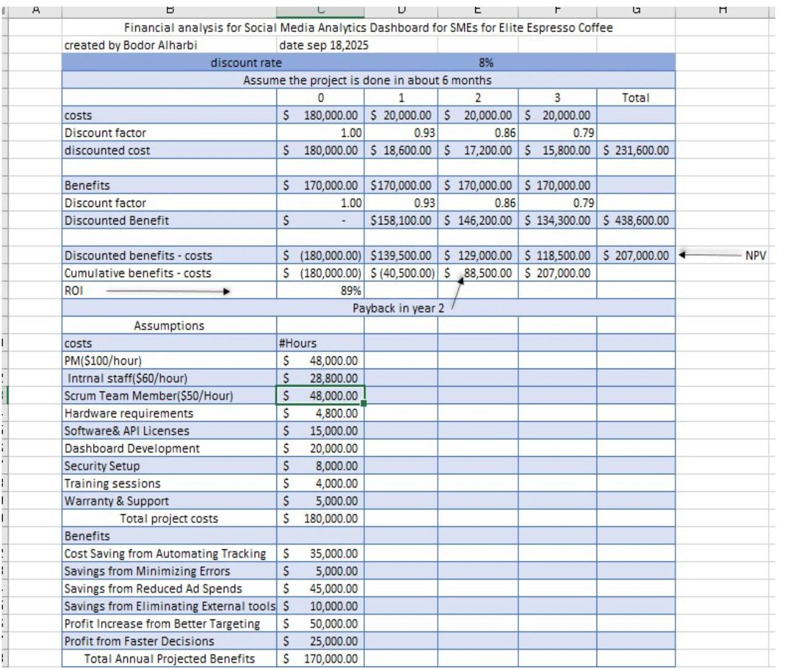
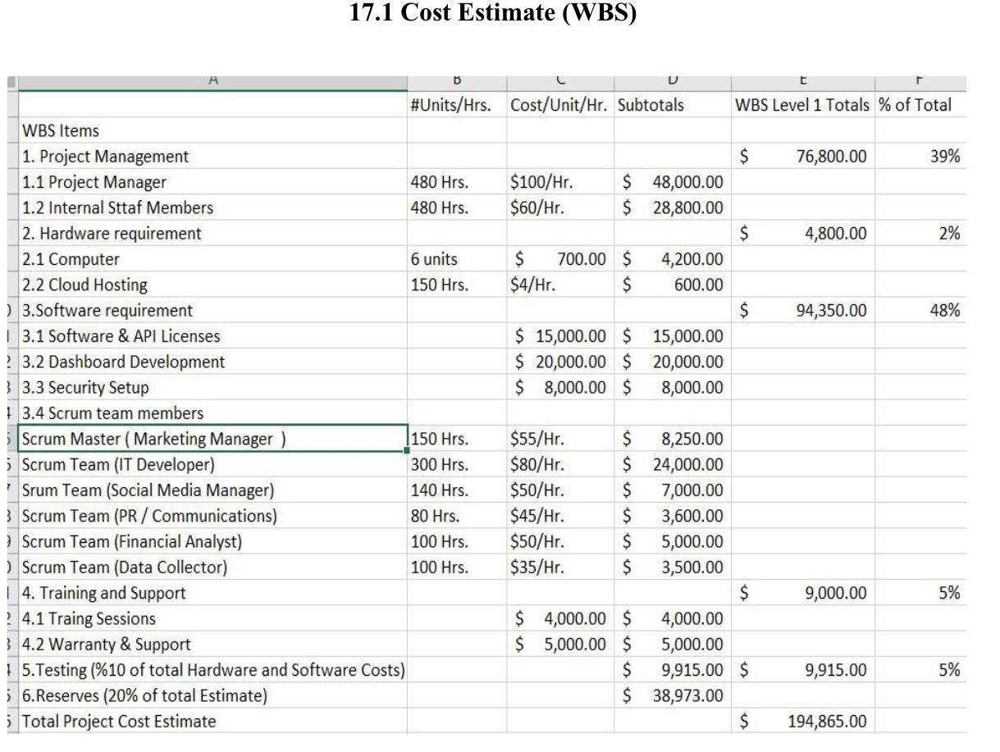

# Social Media Analytics Dashboard for SMEs – Project Management

This academic project focused on planning and managing the development of a Social Media Analytics Dashboard for SMEs. The project covered project planning, scope, scheduling, cost management, risk management, Scrum practices, and project evaluation.

## My Contribution

- Served as the Financial Analyst for the project and took primary responsibility for the financial planning and analysis.

- Determined the project budget and developed the overall cost structure.

- Prepared detailed cost estimates covering project management, hardware, software, training and support, testing, and contingency reserves.

- Developed the cost estimate justification and project cost baseline.

- Conducted the financial feasibility analysis, including NPV, ROI, and Payback Period.

- Estimated the project's expected financial benefits and evaluated its overall financial viability.

- Contributed collaboratively to the other project management activities and documentation throughout the project

  ## Financial Analysis

As the Financial Analyst, I conducted the project's financial feasibility analysis including budget planning, NPV, ROI, and Payback Period.

##Cost Estimate 
Developed the detailed project cost estimate based on the project work breakdown including project management hardware, software, trainging and support, testing, and contingency reserves.

Skills Demonstrated

- Project Management

- Financial Analysis

- Budget Planning

- Cost Estimation

- NPV, ROI, and Payback Period Analysis

- Work Breakdown Structure (WBS)

- Microsoft Excel

- Scrum

- Team Collaboration

